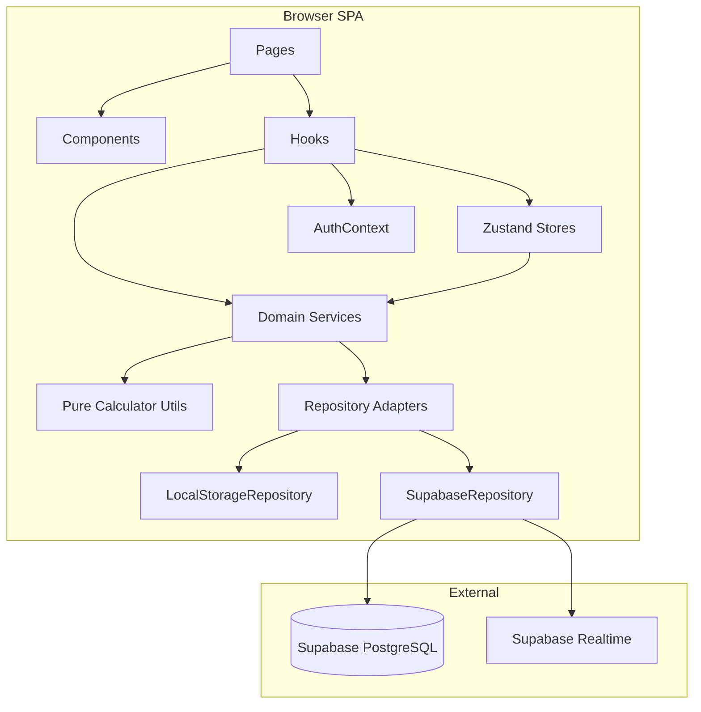
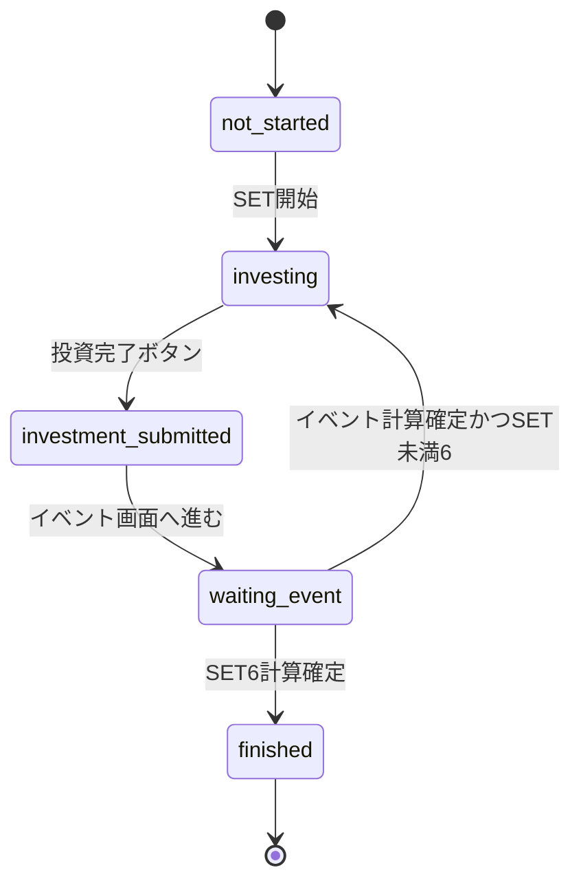
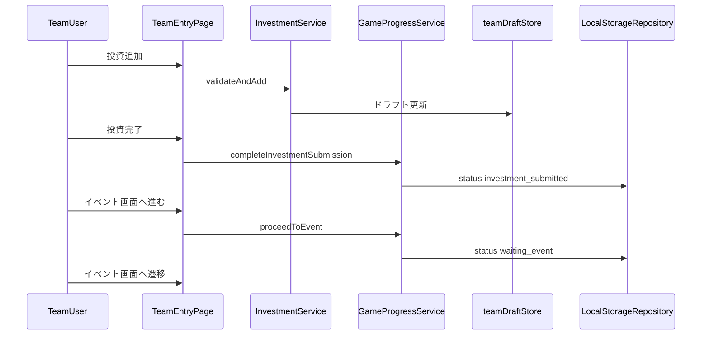
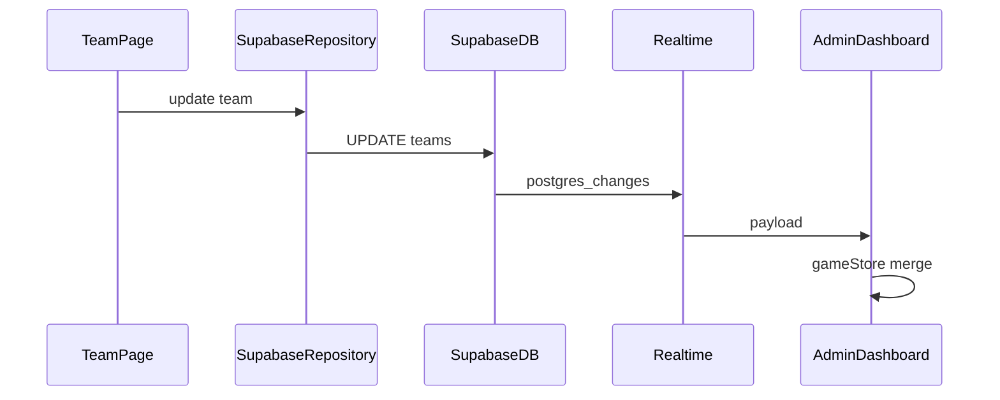
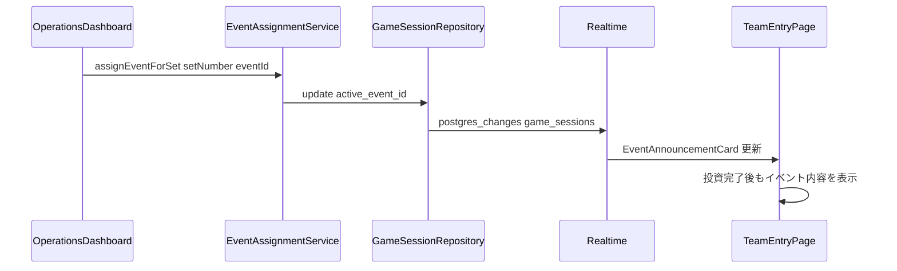
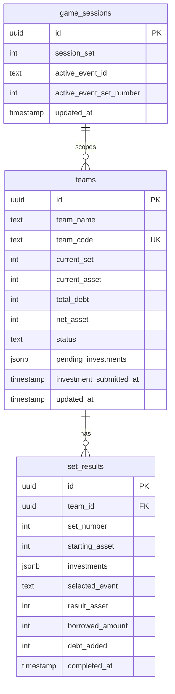
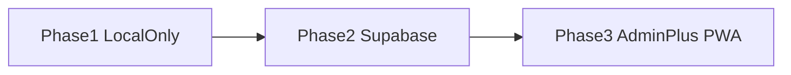

# Design Document — game02-life-allocation

## Overview

「GAME 02 命の配分」の Web 進行管理システム。チームはスマートフォンで投資・借入を入力し、ファシリテーターがイベント結果を計算、運営が全チーム状況をリアルタイム把握する。

**Purpose**: 6 SET の投資ゲームをデジタル化し、計算ミスと進行漏れを防ぐ。  
**Users**: チーム参加者（入力・発表イベント確認）、ファシリテーター（割当イベントでの計算）、運営（イベント決定・一覧・順位・エクスポート）。  
**Impact**: 紙・電卓運用から、共有状態・自動計算・ランキング表示へ移行。

### Goals

- Phase 1: ローカルのみで「入力 → イベント → 計算 → 次 SET」を完結
- Phase 2: Supabase による多チーム同期と Realtime 反映
- Phase 3: 運営ダッシュボード全機能（CSV・リセット・強調表示）
- ドメイン計算の正確性と UI の会場操作性（大数字・大ボタン・ダークテーマ）

### Non-Goals

- 本格ユーザー登録・OAuth
- 物理ボードゲーム部品管理
- サーバーサイドでの高度な不正防止（MVP は簡易認証）
- 多言語対応（初版は日本語 UI のみ）

## Boundary Commitments

### This Spec Owns

- 7 投資先・6 SET・16 標準イベント + BONUS のゲームルール実装
- チーム入力 / イベント結果 / 運営ダッシュボードの SPA
- `game_sessions` / `teams` / `set_results` のデータモデルと同期契約
- 運営ダッシュボードでのイベント選択 → `game_sessions` 更新 → 各チーム端末への発表表示（Phase 2: Realtime、Phase 1: 共有 localStorage + ポーリング/ストア購読）
- 順位・net_asset 算出、CSV エクスポート、ゲームリセット
- SET ごとの投資完了申告と運営向け準備状況（集計・強調表示）

### Out of Boundary

- Supabase プロジェクトのプロビジョニング手順書（運用ドキュメントは別途）
- 会場 Wi-Fi / 端末配布
- 初期資産・チーム数の運営判断値（設定 UI で注入可能とするがデフォルトは設定ファイル）

### Allowed Dependencies

- Supabase（Auth 最小、PostgreSQL, Realtime, JS Client）
- ブラウザ localStorage
- Vite / React / TypeScript / Tailwind CSS / Zustand

### Revalidation Triggers

- `Team` / `SetResult` スキーマ変更
- ステータス enum 追加・変更（`investment_submitted` 等）
- `pending_investments` / `investment_submitted_at` の追加・変更
- 計算式（丸め・BONUS 扱い）変更
- Repository インターフェース変更

## Architecture

### Existing Architecture Analysis

グリーンフィールド。`.kiro/steering/` 未整備。本設計がアーキテクチャの基準となる。

### Architecture Pattern & Boundary Map

**Selected pattern**: Layered SPA + Repository（ドメイン pure functions を中心に UI と永続化を分離）

**Dependency direction**（左から右へ import 可）:

```
types → constants → utils → services → stores → hooks → pages → components
```



| 層 | 責務 |
|----|------|
| `utils` | 計算・バリデーション（副作用なし） |
| `services` | ユースケース编排（進行・投資・借入・同期） |
| `services/repositories` | 永続化抽象化 |
| `stores` | UI 向けキャッシュ・ドラフト状態 |
| `pages` | ルート単位の画面 |

### Technology Stack

| Layer | Choice / Version | Role in Feature | Notes |
|-------|------------------|-----------------|-------|
| Frontend | React 18+ / TypeScript 5+ | SPA UI | `strict: true`, `no any` |
| Build | Vite 5+ | 開発・ビルド | path alias `@/` → `src/` |
| Styling | Tailwind CSS 3+ | ダークテーマ・レスポンシブ | ゲーム用カスタムトークン |
| State | Zustand 4+ | チーム・一覧キャッシュ | ドメイン計算は入れない |
| Session | React Context | 認証フラグ・teamCode | 軽量 |
| Backend | Supabase | DB + Realtime | Phase 2 以降 |
| DB | PostgreSQL（Supabase） | `game_sessions`, `teams`, `set_results` | 要件どおり |
| Client SDK | `@supabase/supabase-js` 2+ | CRUD + subscribe | |
| PWA | `vite-plugin-pwa` | manifest / SW | Phase 3 推奨 |
| Local backup | `localStorage` | オフライン補助 | Phase 1 から |

## File Structure Plan

### Directory Structure

```
src/
├── main.tsx
├── App.tsx                 # Router + AuthProvider
├── components/
│   ├── ui/                 # Button, Card, AmountDisplay, Badge
│   ├── team/               # InvestmentRow, AssetHeader, BorrowAlert, EventAnnouncementCard
│   ├── event/              # AssignedEventPanel, ResultBreakdown
│   └── admin/              # TeamTable, EventAssignPanel, PrepSummaryBar
├── pages/
│   ├── TeamEntryPage.tsx       # /team/:teamCode
│   ├── EventResultsPage.tsx    # /team/:teamCode/event
│   ├── AdminGatePage.tsx       # /admin
│   └── AdminDashboardPage.tsx  # /admin/dashboard
├── hooks/
│   ├── useTeamSession.ts
│   ├── useRealtimeTeams.ts     # Phase 2
│   └── useSetCalculation.ts
├── stores/
│   ├── gameStore.ts            # 全チーム一覧（admin）
│   └── teamDraftStore.ts       # 現 SET ドラフト投資
├── services/
│   ├── gameProgressService.ts
│   ├── investmentService.ts
│   ├── borrowingService.ts
│   ├── eventAssignmentService.ts
│   ├── eventCalculationService.ts
│   ├── rankingService.ts
│   ├── preparationStatusService.ts
│   ├── authService.ts
│   ├── syncService.ts
│   └── repositories/
│       ├── types.ts            # ITeamRepository, ISetResultRepository
│       ├── localStorageRepository.ts
│       ├── supabaseRepository.ts
│       └── gameSessionRepository.ts
├── utils/
│   ├── calculator.ts
│   ├── validation.ts
│   └── csvExport.ts
├── types/
│   ├── domain.ts               # Team, Investment, SetResult, enums
│   └── api.ts
├── constants/
│   ├── game.ts                 # SET_MAX, INVESTMENT_UNIT, BORROW_*
│   ├── sectors.ts
│   └── events.ts               # 付録 A/B 全定義
└── lib/
    └── supabaseClient.ts
```

### Modified Files

（新規プロジェクトのため該当なし）

## System Flows

### SET 進行ステートマシン（1 チーム）



### Phase 1 — チーム入力から次 SET



### Phase 2 — Realtime 同期



### 運営によるイベント発表フロー



## Requirements Traceability

| Requirement | Summary | Components | Interfaces | Flows |
|-------------|---------|------------|------------|-------|
| 1.1–1.8 | SET 進行・投資完了・持ち越し | GameProgressService | GameProgressService | SET ステート |
| 2.1–2.9 | 投資入力・ロック | InvestmentService, TeamEntryPage | InvestmentService | 入力シーケンス |
| 3.1–3.8 | 借入 | BorrowingService | BorrowingService | — |
| 4.1–4.10 | イベント割当・計算 | EventAssignmentService, EventCalculationService | EventAssignmentService | イベント発表 |
| 5.9 | チーム画面へのイベント表示 | EventAnnouncementCard | gameSession | — |
| 6.13–6.15 | 運営イベント決定 | EventAssignPanel | EventAssignmentService | イベント発表 |
| 5.1–5.8 | チーム UI・投資完了 | TeamEntryPage, ui/* | GameProgressService | 入力シーケンス |
| 6.1–6.12 | 運営・準備状況 | AdminDashboard, PreparationStatusService | PreparationStatusService | Realtime |
| 7.1–7.4 | 認証 | AuthService, AuthContext | AuthService | — |
| 8.1–8.4 | 永続化・同期 | Repository, SyncService | ITeamRepository | Realtime |
| 9.1–9.6 | UI テーマ | Tailwind tokens, components | — | — |
| 10.1–10.3 | Phase | Repository 切替 | — | — |

## Components and Interfaces

| Component | Domain/Layer | Intent | Req Coverage | Key Dependencies | Contracts |
|-----------|--------------|--------|--------------|------------------|-----------|
| GameProgressService | Service | SET ライフサイクル・投資完了 | 1 | Repository P0 | Service |
| PreparationStatusService | Service | 準備状況ラベル・集計 | 6.3–6.5 | — | Service |
| InvestmentService | Service | 投資 CRUD・検証 | 2 | Utils P0 | Service |
| BorrowingService | Service | 借入ルール | 3 | Repository P0 | Service |
| EventAssignmentService | Service | SET 単位イベント割当 | 4, 6 | GameSessionRepository P0 | Service |
| EventCalculationService | Service | 割当イベントで計算 | 4 | EventAssignmentService P0 | Service |
| RankingService | Service | 順位算出 | 6.4–6.5 | — | Service |
| AuthService | Service | コード・パスコード | 7 | supabase/env P1 | Service |
| SyncService | Service | Realtime + local 補助 | 8 | Repository P0 | Service, Event |
| LocalStorageRepository | Infra | Phase 1 永続化 | 10.1 | — | State |
| SupabaseRepository | Infra | Phase 2+ 永続化 | 10.2 | supabase P0 | API, State |
| TeamEntryPage | UI | チーム入力画面 | 2, 5 | teamDraftStore P0 | — |
| EventResultsPage | UI | イベント・結果 | 4, 5 | EventCalculationService P0 | — |
| AdminDashboardPage | UI | 運営一覧 | 6, 9 | gameStore, SyncService P0 | — |

### Domain / Services

#### GameProgressService

| Field | Detail |
|-------|--------|
| Intent | SET 開始・投資確定・計算確定・次 SET への遷移 |
| Requirements | 1.1–1.8 |

**Responsibilities & Constraints**
- `current_set` は 1–6。SET6 確定後は `finished`
- **投資完了**（`completeInvestmentSubmission`）: `investing` → `investment_submitted`。`pending_investments` にスナップショット保存、`investment_submitted_at` 記録
- **イベントへ進む**（`proceedToEvent`）: `investment_submitted` → `waiting_event`（事前に投資完了必須）
- 次 SET 開始時: `pending_investments` / `investment_submitted_at` をクリアし `investing` へ
- 未投資残高 = `current_asset - sum(investments)` は計算時に EventCalculationService へ渡す
- 1 SET あたり `set_results` に 1 レコード

**Dependencies**
- Outbound: `ITeamRepository`, `ISetResultRepository` (P0)
- Outbound: `EventCalculationService` (P0) — 計算確定時

##### Service Interface

```typescript
type TeamStatus =
  | 'not_started'
  | 'investing'
  | 'investment_submitted'
  | 'waiting_event'
  | 'completed_set'
  | 'finished';

interface GameProgressService {
  startSet(teamId: string): Promise<Team>;
  completeInvestmentSubmission(
    teamId: string,
    investments: InvestmentLine[]
  ): Promise<Team>;
  proceedToEvent(teamId: string): Promise<Team>;
  confirmSetResult(
    teamId: string,
    input: ConfirmSetInput
  ): Promise<{ team: Team; setResult: SetResult }>;
}

interface ConfirmSetInput {
  setNumber: number;
  startingAsset: number;
  investments: InvestmentLine[];
  selectedEventId: EventId;
  borrowedInSet: boolean;
}
```

- Preconditions: `completeInvestmentSubmission` は status が `investing` かつ投資合計 ≤ 現在資産
- Postconditions: 成功時 status は `investment_submitted`；`proceedToEvent` 成功時は `waiting_event`；`confirmSetResult` 後は次 SET の `investing` または `finished`
- Invariants: `current_set` と `set_results.set_number` の整合

**Implementation Notes**
- Integration: SET 開始時に `starting_asset` をスナップショット
- Validation: SET6 後のみ最終精算フラグ
- Risks: 二重確定 — `set_results` の unique `(team_id, set_number)` 制約

#### InvestmentService

| Field | Detail |
|-------|--------|
| Intent | 投資行の追加・削除・合計検証 |
| Requirements | 2.1–2.9 |

```typescript
interface InvestmentService {
  addInvestment(
    draft: TeamDraft,
    line: Omit<InvestmentLine, 'id'>
  ): Result<TeamDraft, ValidationError>;
  removeInvestment(draft: TeamDraft, lineId: string): TeamDraft;
  getRemainingBudget(draft: TeamDraft): number;
  isEditable(status: TeamStatus): boolean;
}
```

- `getRemainingBudget` = `current_asset - totalInvested(draft.investments)`
- 検証: `amount % INVESTMENT_UNIT === 0`、`total <= current_asset`
- `isEditable`: `investing` のみ `true`（`investment_submitted` / `waiting_event` は編集不可）

#### BorrowingService

| Field | Detail |
|-------|--------|
| Intent | 借入申請・1 SET 1 回制限 |
| Requirements | 3.1–3.8 |

```typescript
interface BorrowingService {
  canBorrow(team: Team): boolean;
  executeBorrow(team: Team): Result<Team, BorrowError>;
  computeFinalAsset(team: Team): number;
}
```

- `canBorrow`: `current_asset < 10_000` かつ当該 SET 未借入
- `executeBorrow`: `current_asset += 80_000`, `total_debt += 100_000`
- `computeFinalAsset`: `current_asset - total_debt`（SET6 後）

#### EventAssignmentService

| Field | Detail |
|-------|--------|
| Intent | 運営による SET 単位イベント決定と全クライアントへの公開 |
| Requirements | 4.1–4.3, 6.13–6.15, 8.2 |

```typescript
interface GameSession {
  id: string;
  session_set: number;
  active_event_id: EventId | null;
  active_event_set_number: number | null;
  updated_at: string;
}

interface EventAssignmentService {
  getSession(): Promise<GameSession>;
  assignEventForSet(setNumber: number, eventId: EventId): Promise<GameSession>;
  getActiveEventForTeam(team: Team, session: GameSession): EventId | null;
}
```

- **所有権**: イベントの「選択」は運営のみ。`assignEventForSet` は管理画面からのみ呼び出す
- `getActiveEventForTeam`: `team.current_set === session.active_event_set_number` のとき `active_event_id` を返す
- Phase 1: `gameSessionRepository` を localStorage の singleton キー `game02:session` で実装
- Phase 2: `game_sessions` テーブル 1 行 + Realtime subscribe

#### EventCalculationService

| Field | Detail |
|-------|--------|
| Intent | 運営割当済みイベントでの計算（選択 UI なし） |
| Requirements | 4.4–4.6, 4.8–4.10 |

```typescript
interface SetCalculationResult {
  lines: Array<{
    sector: Sector;
    invested: number;
    result: number;
    delta: number;
  }>;
  uninvestedCarry: number;
  setEndingAsset: number;
}

interface EventCalculationService {
  preview(
    team: Team,
    investments: InvestmentLine[],
    session: GameSession
  ): Result<SetCalculationResult, 'EVENT_NOT_ASSIGNED'>;
  apply(
    team: Team,
    investments: InvestmentLine[],
    session: GameSession
  ): Result<SetCalculationResult, 'EVENT_NOT_ASSIGNED'>;
}
```

- `eventId` は引数で受け取らず `EventAssignmentService.getActiveEventForTeam` から解決
- 標準: `result = round(invested * (1 + rate))`
- BONUS: `result = round(invested * multiplier)`（率は無視）
- `setEndingAsset = uninvestedCarry + sum(line.result)`

#### PreparationStatusService

| Field | Detail |
|-------|--------|
| Intent | 運営向け準備状況ラベル・SET 単位集計 |
| Requirements | 6.3–6.5 |

```typescript
type PreparationLabel =
  | '入力中'
  | '投資完了'
  | 'イベント待ち'
  | 'SET完了'
  | '終了';

interface PreparationSummary {
  currentSet: number;
  totalTeams: number;
  investmentSubmittedCount: number;
}

interface PreparationStatusService {
  toLabel(status: TeamStatus): PreparationLabel;
  summarize(teams: Team[], focusSet?: number): PreparationSummary;
  isNotReadyForEvent(team: Team): boolean;
}
```

- **集計ルール**: `focusSet`（運営が監視する現在 SET、デフォルトは全チームの `current_set` 最大値または設定値）にいるチームのうち、`status === 'investment_submitted' | 'waiting_event' | ...` を「投資完了済み」とカウント
- 実装簡略化: 同一 SET 進行を前提とし、`current_set === focusSet` のチームのみ分母に含める
- `isNotReadyForEvent`: `status === 'investing'` を true（強調対象）

#### RankingService

| Field | Detail |
|-------|--------|
| Intent | net_asset 降順の順位付け |
| Requirements | 6.7–6.8 |

```typescript
interface RankedTeam extends Team {
  rank: number;
  netAsset: number;
}

interface RankingService {
  rankTeams(teams: Team[], gameFinished: boolean): RankedTeam[];
}
```

- 進行中・終了後とも `netAsset = current_asset - total_debt`（Req 6.4–6.5 は同一式）

#### AuthService

| Field | Detail |
|-------|--------|
| Intent | チームコード・管理パスコード検証 |
| Requirements | 7.1–7.4 |

```typescript
interface AuthService {
  validateTeamCode(code: string): Promise<Team | null>;
  validateAdminPasscode(code: string): boolean;
}
```

- 管理パスコード: `import.meta.env.VITE_ADMIN_PASSCODE` と定数時間比較推奨

#### SyncService

| Field | Detail |
|-------|--------|
| Intent | Realtime subscribe と localStorage 補助 |
| Requirements | 8.1–8.4 |

```typescript
interface SyncService {
  subscribeTeams(onUpdate: (team: Team) => void): () => void;
  subscribeSetResults(onInsert: (row: SetResult) => void): () => void;
  backupDraft(teamCode: string, draft: TeamDraft): void;
  restoreDraft(teamCode: string): TeamDraft | null;
}
```

##### Event Contract（Realtime）

- Subscribed: `postgres_changes` on `game_sessions` (UPDATE), `teams` (INSERT/UPDATE), `set_results` (INSERT)
- Delivery: at-least-once；クライアントは id で merge
- Cleanup: route unmount で `unsubscribe`

### Infrastructure

#### ITeamRepository / ISetResultRepository

```typescript
interface ITeamRepository {
  getByCode(teamCode: string): Promise<Team | null>;
  getById(id: string): Promise<Team | null>;
  listAll(): Promise<Team[]>;
  upsert(team: Team): Promise<Team>;
  resetAll(): Promise<void>;
}

interface ISetResultRepository {
  listByTeam(teamId: string): Promise<SetResult[]>;
  create(result: SetResult): Promise<SetResult>;
}
```

- Phase 1: `LocalStorageRepository` — keys: `game02:teams`, `game02:set_results`
- Phase 2: `SupabaseRepository` — テーブル要件どおり

### UI Layer

#### TeamEntryPage / EventResultsPage / AdminDashboardPage

- **TeamEntryPage**: ルート `/team/:teamCode`。`EventAnnouncementCard` で運営発表済みイベントを**常時表示**（未発表時は「イベント未発表」）。投資完了後も同カードを表示したまま「イベント画面へ進む」
- **EventAnnouncementCard**: イベント名・増減率/倍率一覧（読み取り専用）。**イベント結果画面の直前画面**に配置
- **EventAssignPanel**: 運営ダッシュボード内。16+BONUS から選択して「この SET のイベントを確定」。確定直後に全端末の `EventAnnouncementCard` / `AssignedEventPanel` が同一内容に更新される
- **PrepSummaryBar**: ダッシュボード上部に「SET{n} 投資完了 X / Y チーム」+ 確定イベント名
- **EventResultsPage**: `/team/:teamCode/event`。`AssignedEventPanel`（読み取り専用）+ プレビュー + 計算確定。イベントカード選択グリッドは**実装しない**
- **AdminDashboardPage**: `/admin/dashboard`、テーブル + 強調行（debt / waiting）、CSV ダウンロード

**BaseUIPanelProps**（共有）:

```typescript
interface BaseUIPanelProps {
  className?: string;
  children: React.ReactNode;
}
```

## Data Models

### Domain Model



**Aggregates**
- `GameSession`: セッション全体の進行基準。SET ごとの `active_event_id` を運営が管理（全チーム共通）
- `Team`: チーム単位の進行。`net_asset` は派生（`current_asset - total_debt`）を保存列として同期
- `SetResult`: SET 完了時の不変スナップショット（`selected_event` は割当時の `active_event_id` をコピー）

**Value objects**
- `InvestmentLine`: `{ id, sector, amount }`
- `Sector`: 7 区分 union
- `EventId`: `'evt_01'..` / `'bonus_demand'`

**Invariants**
- `amount % 10_000 === 0`
- `current_set` ∈ [1, 6]（finished 時は固定 6）
- 借入は SET 内最大 1 回（`set_results.debt_added > 0` で判定可能）
- `status === 'investment_submitted'` のとき `pending_investments` は非 null、`investment_submitted_at` は非 null
- イベント計算確定後、次 SET 開始時に `pending_investments` / `investment_submitted_at` をクリア

### Physical Data Model（PostgreSQL）

**game_sessions**（1 セッション = 1 行想定）

| Column | Type | Constraints |
|--------|------|-------------|
| id | uuid | PK |
| session_set | int | NOT NULL — 運営が進行管理する現在 SET |
| active_event_id | text | NULL |
| active_event_set_number | int | NULL — 発表対象 SET |
| updated_at | timestamptz | DEFAULT now() |

**teams**

| Column | Type | Constraints |
|--------|------|-------------|
| id | uuid | PK, default gen_random_uuid() |
| team_name | text | NOT NULL |
| team_code | text | UNIQUE NOT NULL |
| current_set | int | DEFAULT 1, CHECK 1–6 |
| current_asset | int | NOT NULL, >= 0 |
| total_debt | int | DEFAULT 0, >= 0 |
| net_asset | int | NOT NULL |
| status | text | NOT NULL, CHECK in enum（`investment_submitted` 含む） |
| pending_investments | jsonb | NULL — 投資完了時のスナップショット |
| investment_submitted_at | timestamptz | NULL |
| created_at | timestamptz | DEFAULT now() |
| updated_at | timestamptz | DEFAULT now() |

**set_results**

| Column | Type | Constraints |
|--------|------|-------------|
| id | uuid | PK |
| team_id | uuid | FK → teams(id) ON DELETE CASCADE |
| set_number | int | NOT NULL, UNIQUE(team_id, set_number) |
| starting_asset | int | NOT NULL |
| investments | jsonb | NOT NULL |
| selected_event | text | NOT NULL |
| result_asset | int | NOT NULL |
| borrowed_amount | int | DEFAULT 0 |
| debt_added | int | DEFAULT 0 |
| completed_at | timestamptz | DEFAULT now() |

**Indexes**
- `teams(team_code)`
- `set_results(team_id, set_number)`

**Realtime**
```sql
ALTER PUBLICATION supabase_realtime ADD TABLE game_sessions, teams, set_results;
```

### Data Contracts

**investments JSONB 例**

```json
[
  { "id": "uuid", "sector": "agriculture", "amount": 50000 }
]
```

**CSV エクスポート列**: team_name, current_set, current_asset, total_debt, net_asset, rank, status, preparation_label, investment_submitted_at

## Error Handling

### Error Strategy

| Category | Example | Response |
|----------|---------|----------|
| User / Validation | 10,000P 単位違反 | フィールド下に日本語メッセージ、保存ブロック |
| User / Business | 資産超過・借入不可 | トースト + 該当ボタン disabled |
| Auth | 無効 team_code | 専用エラー画面、再入力 |
| System | Supabase 障害 | localStorage ドラフト保持、リトライボタン |
| Conflict | 楽観ロック失敗 | 「他端末で更新されました」+ 再取得 |

### Monitoring

- コンソール structured log（dev）
- Phase 3: Supabase Dashboard + 簡易クライアント error boundary

## Testing Strategy

### Unit Tests

- `calculator.ts`: 付録 A 全 16 イベント × 代表金額、BONUS 倍率、丸め
- `validation.ts`: 単位・上限・借入条件
- `borrowingService`: 80k/100k 加算、1 SET 1 回
- `rankingService`: 同点順位（competition ranking 採用を明記）

### Integration Tests

- `GameProgressService` + `LocalStorageRepository`: 6 SET 完走
- `EventCalculationService` + 未投資持ち越し
- `SupabaseRepository`（Phase 2）: CRUD + mock Realtime

### E2E / UI

- チーム: 投資追加 → 投資完了 → 運営発表イベント表示確認 → イベント画面で計算 → SET2 表示
- 運営: SET イベント確定 → 全チーム入力画面にイベント名反映
- 管理: パスコード → 一覧表示 → CSV ダウンロード
- 借入: 資産 9,000P で借入成功、10,000P 以上で拒否

## Security Considerations

- チームコードは推測困難なランダム文字列（運営が発行）
- 管理パスコードは環境変数のみ（git 除外）
- Phase 2: Supabase RLS — チームは自 `team_code` 行のみ UPDATE、admin は service role または anon + passcode ゲート（MVP はクライアントゲート + 読み取り広め RLS を文書化）
- CSV に個人情報なし（チーム名のみ）

## Performance & Scalability

- 想定: 最大 30 チーム、Realtime イベント頻度低
- 一覧はメモリ merge、全件再取得は再接続時のみ
- イベント定義は constants にバンドル（ランタイム fetch 不要）

## Migration Strategy



- Phase 1 → 2: シードスクリプトで teams 投入、LocalStorage データは手動移行不要（新規セッション想定）
- ロールバック: Feature flag `VITE_DATA_SOURCE=local|supabase`

## Supporting References

- イベント率・倍率の完全表: `requirements.md` 付録 A/B
- 調査ログ: `research.md`
